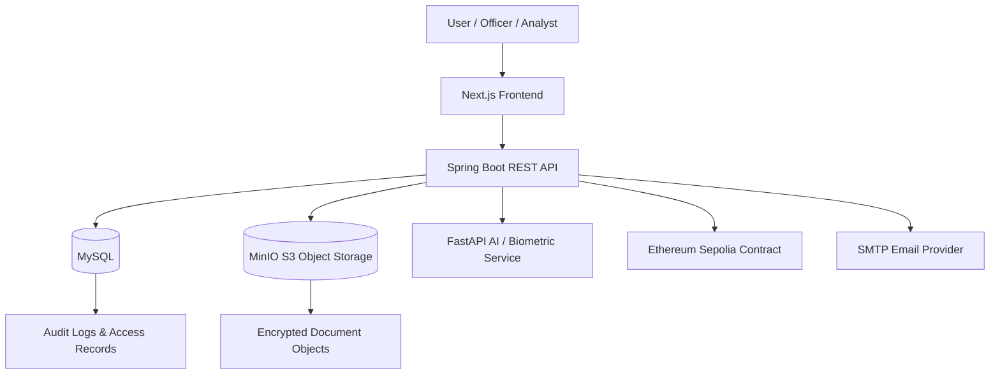
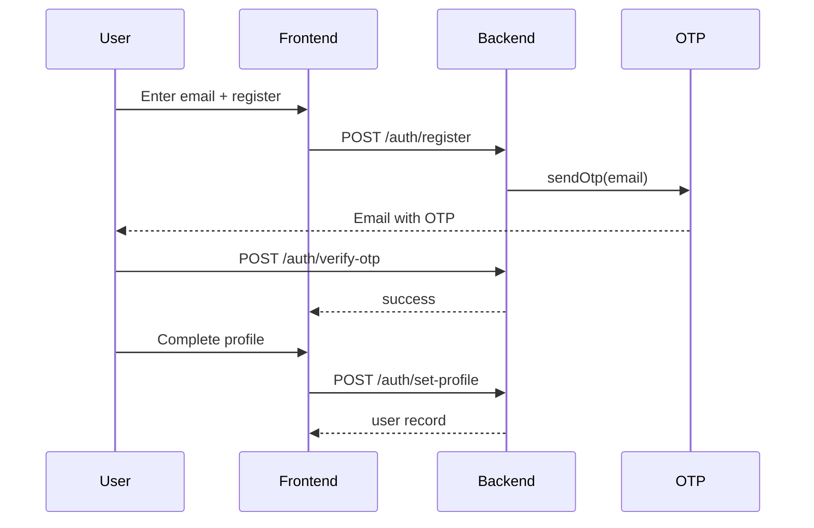
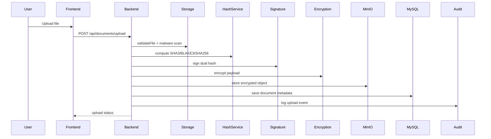
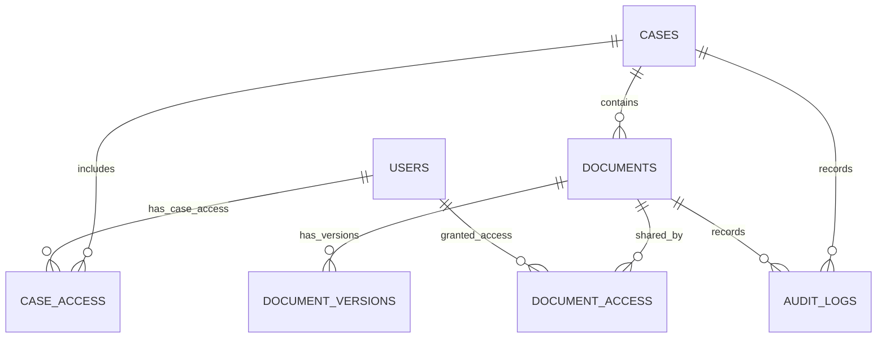
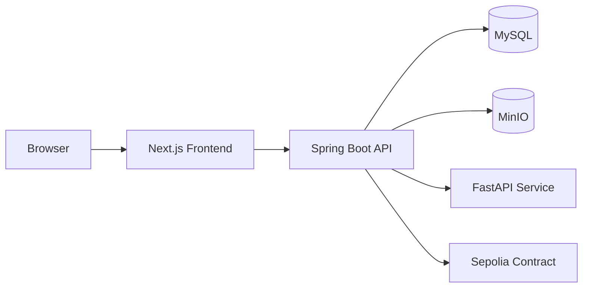

# Project Documentation

## 1. Executive Summary

- Project name: Secure Digital Document Management System (Secure-DMS / NyayaSetu / NyayaVault)
- Project type: Full-stack document security platform with Java Spring Boot backend, Next.js frontend, MySQL metadata database, MinIO object storage, blockchain custody anchoring, and external FastAPI AI/biometric services
- Purpose: Manage evidence/document workflows with document encryption, integrity verification, version management, audit logging, and restricted access controls for investigative and legal use
- Main business problem being solved: Prevent tampering, unauthorized access, and chain-of-custody gaps for sensitive legal and forensic documents
- High-level functionality:
  - User registration with email OTP
  - Login with password + OTP and optional face verification
  - Case creation and case-level access grants
  - Secure document upload with validation, malware checks, hashing, digital signatures, encryption, and MinIO storage
  - Versioned document management with type consistency enforcement
  - Download/preview and integrity verification
  - Case/document access approval workflows
  - Immutable audit logging and blockchain custody records
  - External AI/biometric indexing and search integration via FastAPI
- Current implementation status: Active implementation is present in both backend and frontend. The codebase includes working backend services, REST controllers, JPA entities, and a full UI flow. Some components are clearly demo/prototype oriented (for example, some blockchain access logging is simulated locally rather than fully on-chain) and some runtime connectivity depends on external services such as FastAPI and MinIO.
- Primary users: Investigating officers, prosecutors/legal advisors, forensic analysts, case owners, and other users with case/document access rights. The UI and backend also reference roles such as Investigating Officer, Public Prosecutor, FSL Analyst, Malkhana In-Charge, and Judge, but these are not backed by a formal persisted role system in the database.

---

## 2. Project Overview

This application is a security-centric digital document repository for legal and investigation workflows. The practical implementation is centered on a Spring Boot REST API that authenticates users, creates cases, enforces access permissions, and secures document ingestion and verification. The code clearly shows a design where binary files are stored in MinIO object storage, while metadata, hashes, document records, and access records are stored in MySQL.

The system is designed to fulfill several operational requirements visible in code and project documentation:

- File validation and malware screening before storage
- SHA-256 and dual-hash verification (SHA3-256 + BLAKE3)
- RSA-PSS digital signatures for document authenticity
- AES-256-GCM encryption with wrapped DEK storage
- Blockchain-based custody anchoring via Ethereum Sepolia contract interaction
- Audit events recorded with user, document, case, IP, timestamp, and result
- Access control at both case level and document level
- Face-based biometric login and AI search/indexing via FastAPI

The frontend is a Next.js application that provides a single-page dashboard for authentication, case management, secure uploads, search/filtering, downloads, audit inspection, and access requests.

---

## 3. Scope

### 3.1 In Scope

- User registration and login flows
- OTP-based verification for registration/login
- Optional biometric face login registration/verification
- Case creation and case access control
- Document upload and versioning
- Document download and preview
- Document verification (hash + signature + blockchain integrity checks)
- Access request and approval workflows
- Audit log viewing
- MinIO-backed object storage with local fallback
- MySQL metadata persistence
- Ethereum blockchain anchoring and custody transfer
- FastAPI external AI/ML indexing search proxy
- Security-focused file validation and malware checks

### 3.2 Out of Scope

- Formal multi-role RBAC model persisted in a dedicated database table: Not identified in the current codebase
- Dedicated CI/CD pipeline configuration: Not identified in the workspace
- Database migration scripts: Not identified in the current codebase; JPA uses `ddl-auto=update`
- Dedicated admin dashboard beyond the implemented API/UI patterns: Not identified as a separate module
- Standardized user profile management beyond registration and profile photo capture: Requires confirmation
- Advanced reporting/analytics beyond audit logs and access metadata: Not identified as separate implemented module

---

## 4. Technology Stack

| Layer | Technology | Version / Detail | Purpose |
| --- | --- | --- | --- |
| Frontend | Next.js | 16.3.3 | UI application shell |
| Frontend UI library | React | 19 | Component rendering |
| Frontend styling | Tailwind CSS | 4.3.3 | Styling and layout |
| Backend | Spring Boot | 4.1.1 | Application framework |
| Backend language | Java | 21 | Main backend implementation |
| Security | Spring Security | Included via Spring Boot | JWT/authentication and request protection |
| API layer | Spring Web MVC / REST | Included via Boot | REST endpoints |
| Persistence | Spring Data JPA | Included via Boot | ORM layer |
| Database | MySQL | MySQL 8.x target | Metadata, users, documents, access records |
| Object storage | MinIO | io.minio 8.5.17 + Docker Compose service | Document storage |
| JWT | JJWT | 0.11.5 | Token creation and validation |
| Encryption | Java crypto + BouncyCastle | bcprov/bcpkix 1.78.1 | AES-GCM, RSA-PSS, hash algorithms |
| File validation | Apache Tika | 2.9.2 | MIME and magic-byte analysis |
| Malware scanning | ClamAV integration logic | Optional daemon mode | EICAR and AV scan hooks |
| Hashing | SHA-256, SHA3-256, BLAKE3 | BouncyCastle | Cryptographic file verification |
| Digital signatures | RSA-PSS | 2048-bit key | Authenticity and non-repudiation |
| Encryption | AES-256-GCM | Java JCA | Document encryption |
| Blockchain | Ethereum Sepolia via Web3j | web3j core 4.8.9 | Document anchoring and custody transfer |
| External AI/ML | FastAPI | `fastapi.base.url` configured | Face recognition and semantic search proxy |
| Email | Spring Boot Mail | SMTP via Brevo/SMTP relay | OTP delivery |
| Testing | Spring Boot test starters | Included | Unit/integration tests |
| Build tools | Maven wrapper | `mvnw` | Backend build/run |
| Build tools | Next build | `next build` | Frontend build |

---

## 5. System Architecture

The project follows a layered architecture with a browser client hitting a Next.js frontend, which calls the Spring Boot backend over REST. The backend then uses MySQL for metadata and user/case/access records, MinIO for secure file objects, a FastAPI service for AI/biometric features, and an Ethereum contract for blockchain proof/custody anchoring.



### Frontend architecture

The frontend is implemented as a client-side dashboard in Next.js. It contains authentication flows, case management, upload forms, secure viewer, access requests, and audit views. The UI is not obviously split into multiple top-level pages; instead it behaves like a single dashboard-driven app using stateful component logic.

### Backend architecture

The backend is organized into:

- `controller` package: REST endpoints
- `service` package: business logic
- `repository` package: JPA repositories
- `entity` package: persistence models
- `security` package: JWT filter and security config
- `storage` package: MinIO/local storage abstraction
- `blockchain` package: Ethereum smart-contract integration
- `encryption`, `hashing`, `signature`, `malware`, and `validation` packages: document security pipeline
- `audit` package: audit logging service

### API architecture

The Spring Boot application exposes `/auth/*` for login and registration and `/api/*` for case/document operations. Access to `/api/**` is protected by JWT in security configuration.

### Database architecture

- MySQL is the metadata database.
- Document content is stored in MinIO.
- MySQL records case metadata, user metadata, document metadata, access records, version records, and audit logs.
- `spring.jpa.hibernate.ddl-auto=update` indicates schema generation is handled by JPA rather than explicit migration files.

### Authentication architecture

- JWT bearer token validation via `jwtFilter`
- Spring Security configuration disables CSRF and uses stateless session management
- Passwords are processed with BCryptPasswordEncoder(12)
- OTP is tracked in-memory via `otpService.otps` map
- Face login is supported through an external FastAPI biometric pipeline and direct comparison with stored profile images

### External integrations

- MinIO for S3-compatible storage
- SMTP email provider for OTP delivery
- Ethereum Sepolia RPC for document anchoring and transfer events
- FastAPI for semantic document indexing/search and face verification

### Background processing and storage

- There are no cron jobs or scheduled tasks found in the codebase
- Async or queue-based job system was not identified
- Storage is an abstraction with MinIO and local fallback

---

## 6. Project Structure

```text
SIH/
├── README.md
├── .env.example
├── backend/
│   ├── HELP.md
│   ├── mvnw / mvnw.cmd
│   ├── pom.xml
│   ├── config/
│   │   ├── signing-private-key.der
│   │   └── signing-public-key.der
│   ├── data/
│   │   └── fabric_ledger.json
│   ├── src/
│   │   ├── main/
│   │   │   ├── java/com/security_management/backend/
│   │   │   │   ├── audit/
│   │   │   │   ├── blockchain/
│   │   │   │   ├── config/
│   │   │   │   ├── controller/
│   │   │   │   ├── dto/
│   │   │   │   ├── encryption/
│   │   │   │   ├── entity/
│   │   │   │   ├── exception/
│   │   │   │   ├── hashing/
│   │   │   │   ├── malware/
│   │   │   │   ├── model/
│   │   │   │   ├── repository/
│   │   │   │   ├── security/
│   │   │   │   ├── service/
│   │   │   │   ├── signature/
│   │   │   │   ├── storage/
│   │   │   │   ├── timestamp/
│   │   │   │   └── validation/
│   │   │   └── resources/
│   │   │       ├── application.properties
│   │   │       ├── application-secret.properties
│   │   │       └── application.yml
│   │   └── test/java/com/security_management/backend/
│   ├── storage/
│   │   └── encrypted/cases/...
│   └── target/
├── blockchain/
│   └── contracts/DocumentCustody.sol
├── Frontend/
│   ├── app/
│   ├── components/
│   ├── lib/
│   ├── src/services/api.js
│   ├── package.json
│   └── next.config.mjs
├── MinIO/
│   └── docker-compose.yml
├── ML/
│   └── empty / not populated in workspace snapshot
└── PROJECT_DOCUMENTATION.md
```

### Purpose of major directories

- `backend/`: Main server application; contains models, services, controllers, security, storage, and DB config
- `Frontend/`: Next.js web interface used by officers and analysts
- `blockchain/`: Solidity smart contract and chain custody design artifacts
- `MinIO/`: Docker Compose environment for S3-compatible storage
- `ML/`: Present in workspace but empty at the time of inspection; no implementation found
- `backend/config/`: contains generated RSA key material used for document signatures
- `backend/storage/`: local encrypted fallback storage for encrypted document artifacts

---

## 7. Modules

### Module: Authentication and user onboarding
**Purpose:** Register users, send OTPs, verify OTPs, create JWT tokens, and optionally complete facial login

**Users/Roles:** Users identified by email/username and free-form `position` field. No formal role table was found.

**Main functionality:**
- Email registration request
- OTP verification
- Password login
- Login OTP flow
- Face registration on profile setup
- Face login verification

**Workflow:**
1. User submits registration email
2. App sends OTP to email
3. User verifies OTP
4. User completes profile including username/password, personal details, and optional photo
5. On successful password login, server sends OTP for second-factor verification
6. User can optionally use biometric face verification

**Frontend components:**
- Login panel
- Registration panel
- Face login capture UI in `Frontend/app/page.tsx`

**Backend components:**
- `authRequests`
- `loginService`
- `registerService`
- `otpService`
- `emailService`
- `userDetailSevice`
- `authUtl`

**Database entities:**
- `model.user`
- `model.incompleteprofile`

**APIs:**
- `POST /auth/register`
- `POST /auth/verify-otp`
- `POST /auth/login`
- `POST /auth/verifyLogin-otp`
- `POST /auth/set-profile`
- `POST /auth/face-login`

**Business rules:**
- Registration requires valid email format
- Username is effectively the email address
- User profile photo cannot exceed 5MB
- Accepted image types are JPG, PNG, WEBP
- OTP is stored in-memory by `otpService`

**Validation:**
- Email format validation
- Password and profile field checks on request side
- File size and mime validation for uploaded photo

**Error handling:**
- Registration login errors return HTTP 400/401 with JSON error messages
- Missing profile photo or invalid face payload triggers 400/401 responses

### Module: Case management
**Purpose:** Create investigation cases and grant access to users

**Users/Roles:** Case owner and authorized members

**Main functionality:**
- Create cases
- View all accessible cases
- Get case details
- Grant access to case users
- Request case access and review requests

**Workflow:**
1. Authenticated user creates a case with a case number and title
2. System stores the case and grants access to the creator
3. Other users may request case access
4. Case owner reviews/approves access requests

**Frontend components:**
- Case creation form in dashboard
- Case access request modals
- Case review panel

**Backend components:**
- `CaseAccessController`
- `CaseAccessService`
- `CaseRepository`
- `CaseAccessRepository`
- `CaseAccessRequestRepository`

**Database entities:**
- `entity.cases`
- `entity.accessList.case_access`
- `entity.accessList.CaseAccessRequest`

**APIs:**
- `POST /api/cases`
- `GET /api/cases`
- `GET /api/cases/{caseNumber}`
- `POST /api/cases/{caseNumber}/access`
- `GET /api/cases/{caseNumber}/access`
- `POST /api/cases/{caseNumber}/access/request`
- `GET /api/cases/{caseNumber}/access/requests`
- `PUT /api/cases/access/requests/{requestId}`

**Business rules:**
- A case number must be unique
- Only case owners may grant/review case access
- Access is represented as `AccessStatus.ACTIVE`/`REVOKED`/`EXPIRED`

### Module: Secure document lifecycle
**Purpose:** Safely upload documents, create versions, and manage secure storage and metadata

**Users/Roles:** Authenticated users with case access

**Main functionality:**
- Upload original document to a case
- Enforce file validation and malware scanning
- Generate dual hashes and RSA-PSS signature
- Encrypt document with AES-GCM and store encrypted file in MinIO
- Record document metadata and version metadata in MySQL
- Create new document versions
- Enforce extension consistency between versions

**Workflow:**
1. User selects a file and case
2. Backend validates the file
3. Backend scans for malware or EICAR signature
4. Backend computes SHA-256, SHA3-256, and BLAKE3
5. Backend signs the hash with RSA-PSS
6. Backend encrypts file content and stores encrypted object in MinIO
7. Backend saves metadata and proofs in MySQL
8. Backend logs audit event and optionally anchors record on blockchain

**Frontend components:**
- Upload area and pipeline step display
- Version upload modal

**Backend components:**
- `DocumentController`
- `DocumentUploadService`
- `FileValidationService`
- `MalwareScanService`
- `HashService`
- `DigitalSignatureService`
- `EncryptionService`
- `MinioStorageService` / `StorageService`
- `DocumentRepository`
- `DocumentVersionRepository`

**Database entities:**
- `Document`
- `DocumentVersion`

**APIs:**
- `POST /api/documents/upload`
- `POST /api/documents/{id}/versions`
- `GET /api/documents`
- `GET /api/documents/{id}`

### Module: Secure download / preview / verification
**Purpose:** Allow authorized users to retrieve documents and verify integrity and authenticity before display or download

**Main functionality:**
- Download with verification headers
- Preview file inline in browser
- Verify document cryptographic integrity and blockchain record
- View secure session watermark metadata
- Generate chain-of-custody audit events

**Workflow:**
1. User requests document download or preview
2. API checks case and document access
3. Backend fetches encrypted object from MinIO
4. Backend unwraps DEK and decrypts file in memory
5. Backend recomputes hashes and validates against stored hash
6. Backend checks signature and blockchain result
7. Response is returned with headers indicating integrity and verification status

**Frontend components:**
- `SecureDocumentViewer.tsx`
- Evidence preview modal
- Verification modal

**Backend components:**
- `DocumentDownloadService`
- `DocumentVerificationService`
- `DocumentController`

**APIs:**
- `GET /api/documents/{id}/download`
- `GET /api/documents/{id}/preview`
- `GET /api/documents/{id}/verify`
- `GET /api/documents/{id}/view-session`
- `GET /api/documents/{id}/blockchain`

**Business rules:**
- If the computed hash differs from stored hash, the system throws an integrity exception
- If the decrypted file fails AES-GCM validation, it is treated as tampered
- Only authorized users with valid case/document access can download or preview

### Module: Case/document access governance
**Purpose:** Manage access grants, requests, and permission changes at both case and document scopes

**Main functionality:**
- Grant/revoke document access
- Update document permission
- Request document access
- Approve/reject access requests
- Check whether a user has a required permission

**Backend components:**
- `DocumentAccessController`
- `DocumentAccessService`
- `DocumentAccess`, `DocumentAccessRequest`, `DocumentPermission`

**APIs:**
- `POST /api/documents/{documentId}/access`
- `POST /api/documents/{documentId}/access/request`
- `GET /api/documents/{documentId}/access/requests`
- `GET /api/documents/{documentId}/access`
- `GET /api/documents/{documentId}/access/check`
- `PUT /api/documents/{documentId}/access/{userId}`
- `DELETE /api/documents/{documentId}/access/{userId}`
- `GET /users/{userId}/access`

**Business rules:**
- Case access is required before document access is considered valid for most actions
- Document permission values are `VIEW`, `DOWNLOAD`, `UPLOAD`, `EDIT`, `SHARE`, and `DELETE`
- Access records can be active, revoked, or expired

### Module: Blockchain custody and audit chain
**Purpose:** Track the document’s blockchain record and chain of custody

**Main functionality:**
- Anchor document record on Ethereum Sepolia
- Transfer custody between users
- Retrieve blockchain document record
- Retrieve custody history
- Emit audit events for actions and results

**Backend components:**
- `EthereumBlockchainService`
- `BlockchainService`
- `DocumentController` blockchain endpoints
- `AuditService`

**Database entities:**
- `AuditLog`

**APIs:**
- `GET /api/documents/{id}/blockchain`
- `POST /api/documents/{id}/custody/transfer`
- `GET /api/audit-logs`

**Business rules:**
- Some blockchain access logging is deliberately treated as a local or simulated success in the service implementation, rather than a full on-chain event log
- The Solidity contract stores a mapping from document ID to a record with `documentId`, `documentHash`, `currentCustodian`, `timestamp`, and `isAnchored`

### Module: FastAPI AI and biometric integration
**Purpose:** Proxy AI-enabled indexing, semantic search, face registration, and face verification to an external FastAPI microservice

**Main functionality:**
- Index a document and prepare it for search
- Search across indexed documents
- Register a face image for a user
- Verify a live face against the registered image
- Provide health check status

**Backend components:**
- `FastApiController`
- `FastApiService`
- `FastApiServiceImpl`
- `FastApiConfig`

**APIs:**
- `POST /api/fastapi/index-document`
- `POST /api/fastapi/search`
- `POST /api/fastapi/face/register`
- `POST /api/fastapi/face/verify`
- `GET /api/fastapi/health`

**Business rules:**
- These are pass-through proxy endpoints; the actual AI logic resides in the external FastAPI service
- The app infrastructure is configured to call a remote FastAPI base URL specified by `fastapi.base.url`

---

## 8. Complete Feature Documentation

## Feature: User registration with OTP

### Description
Allows a new user to register using an email address, receive an OTP, verify it, and complete a profile with identifying information and optional photo.

### Purpose
Simplify onboarding and provide a two-step verification route before a new user is accepted into the digital evidence system.

### User Roles
Any new user can register. The system does not appear to enforce a role at registration time; the profile stores `position` as a string.

### User Flow
1. User enters email in the registration form
2. Backend checks for a valid email and uniqueness
3. OTP is sent by email and stored in memory
4. User submits OTP for verification
5. User completes profile and optional photo upload
6. Profile is saved to `users`
7. Face image is forwarded to FastAPI for registration if provided

### UI / Screens
- Registration tab in `Frontend/app/page.tsx`
- Photo capture input and preview

### Inputs
| Field | Type | Required | Validation | Description |
| --- | --- | --- | --- | --- |
| email | string | Yes | Email regex | User email / username |
| otp | string | Yes in verification stage | Matches in-memory OTP | Login/registration verification |
| username | string | Yes | Not blank | Usually the email value |
| password | string | Yes | Not blank | Stored as BCrypt hash in app flow |
| firstName | string | Yes | Not blank | Display name |
| lastName | string | Yes | Not blank | Display name |
| position | string | No | Defaulted | Example investigation role |
| aadharNumber | string | No | Optional | Personal identifier |
| phoneNumber | string | No | Optional | Contact information |
| photo | file | No | 5MB limit, JPG/PNG/WEBP | Profile image |

### Processing
The backend validates the email, sends an OTP via `emailService`, verifies the OTP in `otpService`, then persists the profile via `setprifileService` and optionally forwards the face image to FastAPI.

### APIs
- `POST /auth/register`
- `POST /auth/verify-otp`
- `POST /auth/set-profile`

### Database
- `users` table: stores profile data and profile image as `LONGBLOB`

### Business Rules
- Email must match a standard email format
- Duplicate email registration is rejected
- Profile photo must be a supported image and under 5MB

### Errors & Edge Cases
- `Email is already taken`
- `Please provide a valid email address.`
- `Profile photo exceeds maximum limit of 5MB`
- `Invalid photo format.`

---

## Feature: Password login with OTP and optional face login

### Description
The login workflow supports username/password verification followed by OTP validation and optional biometric face login.

### Purpose
Add a second factor and allow a stronger biometric alternative.

### User Roles
Authenticated users with a saved profile.

### User Flow
1. User enters username/email and password
2. Backend authenticates via Spring Security and `AuthenticationManager`
3. If credentials are valid, server sends login OTP by email
4. User enters OTP via `/auth/verifyLogin-otp`
5. On success, the user receives a JWT token
6. Alternative: user may log in using live face image and a registered profile photo

### UI / Screens
- Login form with OTP step
- Face login capture panel

### Inputs
- Username
- Password
- OTP
- Live photo for face login

### Processing
- Password is validated through `AuthenticationManager`
- OTP is compared against the in-memory `otps` store
- JWT is generated by `authUtl.generateAccessToekn(user)`
- Face verification is proxied to FastAPI service and returns similarity/confidence

### APIs
- `POST /auth/login`
- `POST /auth/verifyLogin-otp`
- `POST /auth/face-login`

### Database
- `users` table, plus face image data in `profile_image`

### Business Rules
- User cannot login if the email/account is not found
- Invalid OTP is rejected
- Face login requires a registered profile photo
- Face login returns 401 if no reference photo exists

### Errors & Edge Cases
- Login OTP email failure still returns stateful error message
- Expired/invalid JWT results in 401 unauthorized

---

## Feature: Case creation and access approval

### Description
Users can create investigation cases, request access to existing cases, and review case access requests.

### Purpose
Support controlled access to evidence groups associated with investigations.

### User Roles
Case creator is granted access automatically. Others can request access.

### User Flow
1. Authenticated user creates case with number, title, description
2. Case is saved and creator is granted active case access
3. Other users request case access
4. Owner reviews and approves or rejects access request

### UI / Screens
- Dashboard case creation form
- Access request modal
- Case access management panel

### Inputs
- `caseNumber`
- `title`
- `description`
- `requestedUserId`
- `reason`

### Processing
- Service ensures case number uniqueness
- `grantCaseAccess` creates a `case_access` record
- Requests are persisted in `case_access_requests`
- Review toggles approval status and grants access to requestor if approved

### APIs
- `POST /api/cases`
- `GET /api/cases`
- `GET /api/cases/{caseNumber}`
- `POST /api/cases/{caseNumber}/access/request`
- `GET /api/cases/{caseNumber}/access/requests`
- `PUT /api/cases/access/requests/{requestId}`

### Database
- `cases`
- `case_access`
- `case_access_requests`

### Business Rules
- Only the case owner can manage access requests
- Case number uniqueness is enforced by unique constraint
- Access status uses enum values `ACTIVE`, `REVOKED`, `EXPIRED`

---

## Feature: Secure document upload and versioning

### Description
This is the core document-security feature. Files are validated, scanned, hashed, signed, encrypted, and stored in MinIO with metadata in MySQL.

### Purpose
Protect chain of custody for sensitive evidence and ensure the document cannot be silently modified.

### User Roles
Authenticated users with active case access.

### User Flow
1. User selects file and case
2. Backend validates file size, name, and type
3. Malware scan is executed
4. Hashes are calculated
5. RSA-PSS signature is generated
6. Document is encrypted with AES-256-GCM and stored in MinIO
7. Metadata and version data are stored in MySQL
8. Audit log is recorded and document may be anchored on blockchain

### UI / Screens
- Upload dashboard
- Document upload pipeline step progress
- Version upload modal

### Inputs
- `file`
- `caseId`
- `documentType` (default `FIR`)
- `classification` (default `CONFIDENTIAL`)
- `uploadedBy` (derived from authenticated user)

### Processing
Implementation is in `DocumentUploadService` and includes the following stages:
- file validation
- malware check (EICAR, optional ClamAV daemon)
- dual hashing (SHA3-256 + BLAKE3 + SHA256)
- digital signature via RSA-PSS
- AES-256-GCM encryption
- MinIO storage with ciphertext object key
- DB save of `Document` and `DocumentVersion`
- blockchain anchoring

### APIs
- `POST /api/documents/upload`
- `POST /api/documents/{id}/versions`

### Database
- `documents`
- `document_versions`

### Business Rules
- Version extension must match the original document type/format
- Malware detection rejects upload
- Previous version is marked `SUPERSEDED` when a new version is uploaded
- `documents.current_version` is updated as new versions are added

### Errors & Edge Cases
- Invalid MIME or malicious content leads to strict rejection
- Encryption or DB save failure after storage causes cleanup by deleting object
- Missing or null required values cause security exceptions

---

## Feature: Secure document download, preview, and verification

### Description
Authorized users can download or preview documents only after verification steps confirm integrity, authenticity, and blockchain presence.

### Purpose
Allow evidence review while enforcing tamper detection and auditability.

### User Roles
Users with active access to the case and sufficient document permissions.

### User Flow
1. User selects a document
2. System checks case access and document access permission
3. Backend retrieves the encrypted object from MinIO
4. Backend decrypts it in memory
5. Hashes are recomputed and compared to stored values
6. Signature verification is performed
7. Blockchain verification is performed
8. Download or preview response is returned with verification headers

### UI / Screens
- Vault list
- Secure document viewer
- Audit and verification modals

### Inputs
- `documentId`
- `version` (optional)
- `userId` (ignored in controller but may be passed)

### Processing
Handled by `DocumentDownloadService` and `DocumentController`.

### APIs
- `GET /api/documents/{id}/download`
- `GET /api/documents/{id}/preview`
- `GET /api/documents/{id}/verify`
- `GET /api/documents/{id}/view-session`

### Database
- Reads from `documents`, `document_versions`, and audit logs

### Business Rules
- If computed hash does not match stored hash, integrity failure is thrown
- If decryption fails or tag mismatch is detected, document is treated as tampered
- Signature validity and blockchain validity are returned in HTTP response headers

### Errors & Edge Cases
- `Document not found`
- `User is not authorized to download this document.`
- `CRITICAL_SECURITY_ALERT` events logged when verification fails

---

## Feature: Access request and permission workflow

### Description
This feature governs access at the document level and supports approval/rejection workflows.

### Purpose
Allow case owners or document owners to grant or revoke access without broad manual privileges.

### User Roles
Case owners and authorized administrators.

### User Flow
1. Authorized user requests document access to another user
2. Request is stored with permission and reason
3. Document owner or case owner reviews request
4. Approval grants access record; rejection marks request as rejected

### UI / Screens
- Request access modal
- Owner review panel

### Inputs
- `documentId`
- `requestedUserId`
- `permission`
- `reason`
- `approved`

### Processing
Handled by `DocumentAccessService` and `DocumentAccessController`.

### APIs
- `POST /api/documents/{documentId}/access/request`
- `GET /api/documents/{documentId}/access/requests`
- `PUT /api/documents/access/requests/{requestId}`
- `POST /api/documents/{documentId}/access`
- `PUT /api/documents/{documentId}/access/{userId}`
- `DELETE /api/documents/{documentId}/access/{userId}`

### Database
- `document_access`
- `document_access_requests`

### Business Rules
- Only same-case or owner-authorized actions are accepted
- Duplicate active access attempts trigger a conflict exception
- `DocumentPermission` enum values determine allowed actions

---

## Feature: Blockchain custody record and transfer

### Description
Document records can be anchored to a blockchain and custody can be transferred to another custodian.

### Purpose
Add an immutable ledger-style record for custody and document anchoring.

### User Roles
Case-authorized users with access to document records.

### User Flow
1. Document is uploaded and anchored to blockchain
2. `BlockchainRecordDto` is created with document ID, hash, id, and custodian
3. Later, custody can be transferred through `transferCustody`
4. Frontend can call `/api/documents/{id}/blockchain` to inspect records

### UI / Screens
- Document verification and blockchain status display
- Custody transfer action

### Processing
- Ethereum smart-contract integration uses Web3j and a Sepolia RPC URL
- Contract is defined in `blockchain/contracts/DocumentCustody.sol`

### APIs
- `GET /api/documents/{id}/blockchain`
- `POST /api/documents/{id}/custody/transfer`

### Database
- Internal metadata is stored in MySQL; blockchain is external chain-backed state

### Business Rules
- Contract requires entry before transfer
- `recordAccess` is sometimes handled locally instead of on-chain, as visible in service code

---

## Feature: FastAPI semantic search and face verification

### Description
The backend acts as a proxy to an external FastAPI service for document indexing, semantic search across indexed content, face registration, and face verification.

### Purpose
Support AI-assisted search and biometric authentication.

### User Roles
Authenticated users and face-registered users.

### User Flow
1. User uploads or indexes a document
2. FastAPI receives the file and indexes it for semantic retrieval
3. User submits a search query to the backend
4. Backend forwards the search to FastAPI and returns results
5. User may register or verify a face via the backend

### Processing
Handled by `FastApiController` and `FastApiServiceImpl` using `RestTemplate` and multipart requests.

### APIs
- `POST /api/fastapi/index-document`
- `POST /api/fastapi/search`
- `POST /api/fastapi/face/register`
- `POST /api/fastapi/face/verify`
- `GET /api/fastapi/health`

### Dependencies
- Remote FastAPI app
- Image and document upload data

---

## 9. User Roles & Permissions

There is no formally persisted role table found in the codebase. The visible app uses a UI-side role list in `Frontend/src/services/api.js`, but the backend does not expose a robust role enum or role-based security layer at the controller level. Instead, protection is mostly based on authentication and case/document access records.

| Role (UI label) | Description | Permissions / Enforcement |
| --- | --- | --- |
| Investigating Officer | Default user persona in app | Authenticated access; can create cases, upload documents, request access |
| Public Prosecutor / Legal Advisor | UI-defined role | Access based on case/document permissions; not formally enforced in DB |
| FSL Analyst | UI-defined role | Access to upload/verify flows in UI; actual enforcement is via case access service |
| Malkhana In-Charge | UI-defined role | Access to custody-related workflows; no formal persisted role check found |
| Judge | UI-defined role | UI-only role with viewing/verification privileges; no dedicated DB role table found |

### Authentication
- JWT bearer tokens are required for `/api/**`
- `/auth/**` and `/public/**` are permitted without authentication
- Basic auth is configured with Spring Security but the app primarily uses JWT filtering

### Authorization
- `webSecurityConfiguration` permits all `/auth/**`, `/public/**`, `/admin/**`, `/h2-console/**`, and `/actuator/**`
- `/api/**` is protected and requires authentication
- Case-specific access is enforced by `CaseAccessService.requireCaseAccess` and `.requireCaseOwner`
- Document-specific access is enforced by `DocumentAccessService.checkAccess`

### Protected routes / APIs
- All `/api/**` endpoints require authentication via security filter
- Download, preview, verify, and access-change endpoints enforce case/document authorization checks

---

## 10. User Workflows

### Workflow: Registration and onboarding
1. User enters email
2. App hits `/auth/register`
3. OTP is sent by email
4. User confirms OTP at `/auth/verify-otp`
5. User fills profile details and optional photo
6. `set-profile` persists the record and forwards face image to FastAPI if present
7. User can now log in



### Workflow: Password login and OTP validation
1. User submits username/password
2. Spring Security validates password
3. Backend sends login OTP by email
4. User validates OTP
5. JWT is issued
6. UI stores token and uses it for `/api/**` calls

### Workflow: Secure upload pipeline
1. User picks file and selects case
2. API validates file and performs malware check
3. Hashes and signature are generated
4. File is encrypted and stored in MinIO
5. Metadata is saved in `documents` and `document_versions`
6. Audit log is written
7. On-chain anchor is attempted/recorded



### Workflow: Secure document preview and verification
1. User requests download/preview
2. Backend checks access permissions
3. File is fetched from MinIO
4. Decrypt and verify hash/signature
5. Blockchain record is checked
6. Response is returned with verification headers

---

## 11. API Documentation

### Authentication APIs

#### `POST /auth/register`
**Purpose:** Request registration OTP.
**Authentication:** None
**Request:**
```json
{ "mail": "user@example.com" }
```
**Response:**
```json
{ "status": "success", "message": "OTP sent to your email." }
```
**Implementation:** `authRequests.registerUser` and `registerService.registerUser`

#### `POST /auth/verify-otp`
**Purpose:** Verify registration OTP.
**Authentication:** None
**Request:**
```json
{ "email": "user@example.com", "otp": "123456" }
```
**Response:**
```json
{ "status": "success", "message": "verification Successfull" }
```

#### `POST /auth/login`
**Purpose:** Validate credentials and trigger login OTP.
**Authentication:** None
**Request:**
```json
{ "username": "user@example.com", "password": "secret" }
```
**Response:**
```json
{ "status": "success" }
```

#### `POST /auth/verifyLogin-otp`
**Purpose:** Validate OTP for login and allow continuation.
**Authentication:** None
**Request:**
```json
{ "email": "user@example.com", "otp": "123456" }
```
**Response:**
```json
{ "status": "success", "message": "OTP verified successfully. Proceed to face authentication." }
```

#### `POST /auth/set-profile`
**Purpose:** Save profile details and optional photo.
**Authentication:** None for this route in security config; application logic expects valid user metadata but this endpoint is public by pattern.
**Request:** multipart/form-data with `username`, `password`, `firstName`, `lastName`, optional `position`, `aadharNumber`, `phoneNumber`, `photo`
**Response:** `user` JSON object

#### `POST /auth/face-login`
**Purpose:** Authenticate by matching live face to registered profile photo.
**Authentication:** None
**Request:** multipart/form-data with `email` and `livePhoto`
**Response:**
```json
{ "status": "success", "token": "...", "username": "...", "role": "...", "confidence": 0.92 }
```

### Case APIs

#### `POST /api/cases`
**Purpose:** Create a new case.
**Authentication:** Required
**Request:**
```json
{ "caseNumber": "CASE-2026-001", "title": "Title", "description": "...", "createdBy": "user" }
```
**Response:** `cases` entity

#### `GET /api/cases`
**Purpose:** List accessible cases for the current user.
**Authentication:** Required

#### `GET /api/cases/{caseNumber}`
**Purpose:** Get a specific case.
**Authentication:** Required

#### `POST /api/cases/{caseNumber}/access`
**Purpose:** Grant case access to a user.
**Authentication:** Required

#### `GET /api/cases/{caseNumber}/access`
**Purpose:** List case users.
**Authentication:** Required

#### `POST /api/cases/{caseNumber}/access/request`
**Purpose:** Request access to a case.
**Authentication:** Required

#### `GET /api/cases/{caseNumber}/access/requests`
**Purpose:** Retrieve pending case access requests.
**Authentication:** Required

#### `PUT /api/cases/access/requests/{requestId}`
**Purpose:** Review a case access request.
**Authentication:** Required

### Document APIs

#### `POST /api/documents/upload`
**Purpose:** Upload a new encrypted document and create version 1.
**Authentication:** Required
**Request:** multipart/form-data with `file`, `caseId`, optional `documentType`, `classification`
**Response:** `UploadDocumentResponse` JSON with document metadata and cryptographic details

#### `POST /api/documents/{id}/versions`
**Purpose:** Upload a new version of an existing document.
**Authentication:** Required
**Request:** multipart/form-data with `file`

#### `GET /api/documents`
**Purpose:** List documents visible to the authenticated user.
**Authentication:** Required

#### `GET /api/documents/{id}`
**Purpose:** Get document metadata and version history.
**Authentication:** Required

#### `GET /api/documents/{id}/download`
**Purpose:** Download a verified and decrypted document.
**Authentication:** Required
**Response:** file stream plus verification headers

#### `GET /api/documents/{id}/versions/{version}/download`
**Purpose:** Download a specific version.
**Authentication:** Required

#### `GET /api/documents/{id}/preview`
**Purpose:** Inline preview of the document in the browser.
**Authentication:** Required

#### `GET /api/documents/{id}/verify`
**Purpose:** Verify document integrity, signature, and blockchain proof.
**Authentication:** Required

#### `GET /api/documents/{id}/view-session`
**Purpose:** Generate secure viewing session metadata and watermark lines.
**Authentication:** Required

#### `GET /api/documents/{id}/blockchain`
**Purpose:** Retrieve blockchain document record and chain-of-custody history.
**Authentication:** Required

#### `POST /api/documents/{id}/custody/transfer`
**Purpose:** Transfer document custody.
**Authentication:** Required

#### `GET /api/audit-logs`
**Purpose:** Retrieve audit logs; optional `documentId` or `caseId` filter.
**Authentication:** Required

### Document access APIs

#### `POST /api/documents/{documentId}/access`
**Purpose:** Grant direct document-level access.
**Authentication:** Required

#### `POST /api/documents/{documentId}/access/request`
**Purpose:** Request document access.
**Authentication:** Required

#### `GET /api/documents/{documentId}/access/requests`
**Purpose:** List access requests for a document.
**Authentication:** Required

#### `PUT /api/documents/access/requests/{requestId}`
**Purpose:** Review document access request.
**Authentication:** Required

#### `GET /api/documents/{documentId}/access`
**Purpose:** List users with access to a document.
**Authentication:** Required

#### `PUT /api/documents/{documentId}/access/{userId}`
**Purpose:** Update document permission for a user.
**Authentication:** Required

#### `DELETE /api/documents/{documentId}/access/{userId}`
**Purpose:** Revoke access for a user.
**Authentication:** Required

#### `GET /api/documents/{documentId}/access/check`
**Purpose:** Check whether current user has a permission.
**Authentication:** Required

#### `GET /api/users/{userId}/access`
**Purpose:** List the documents a user can access.
**Authentication:** Required

### FastAPI proxy APIs

#### `POST /api/fastapi/index-document`
**Purpose:** Proxy to FastAPI document indexing.
**Authentication:** Required by route protection due to `/api/**`

#### `POST /api/fastapi/search`
**Purpose:** Proxy semantic query to FastAPI.
**Authentication:** Required

#### `POST /api/fastapi/face/register`
**Purpose:** Proxy face registration to FastAPI.
**Authentication:** Required

#### `POST /api/fastapi/face/verify`
**Purpose:** Proxy face verification to FastAPI.
**Authentication:** Required

#### `GET /api/fastapi/health`
**Purpose:** Check FastAPI health status.
**Authentication:** Required

---

## 12. Database Documentation

## Database Technology

- Database system: MySQL
- Persistence framework: Spring Data JPA
- Schema generation: `spring.jpa.hibernate.ddl-auto=update`
- No explicit migration files were found in the codebase

## Tables / Collections

### `users`
| Column | Type | Nullable | Description |
| --- | --- | --- | --- |
| `userId` | Integer (PK) | No | Auto-generated user id |
| `username` | String | No | Email / login username |
| `password` | String | No | Stored password |
| `firstName` | String | No | User first name |
| `lastName` | String | No | User surname |
| `position` | String | No | Role-like free-form position string |
| `aadharNumber` | String | No | National ID placeholder |
| `phoneNumber` | String | No | Contact number |
| `profile_image` | LONGBLOB | Yes | Stored profile image bitmap |

### `cases`
| Column | Type | Nullable | Description |
| --- | --- | --- | --- |
| `caseId` | Integer (PK) | No | Auto-generated case ID |
| `case_number` | String | No | Unique case number, e.g. `CASE-2026-001` |
| `title` | String | No | Case title |
| `description` | String | Yes | Case summary |
| `status` | Enum (`Status`) | Yes | `DRAFT`, `OPEN`, `ON_HOLD`, `CLOSED`, `ARCHIVED` |
| `created_by` | String | Yes | Creator user reference |
| `createdAt` | LocalDateTime | Yes | Creation timestamp |
| `lastUpdate` | LocalDateTime | Yes | Last update |

### `documents`
| Column | Type | Nullable | Description |
| --- | --- | --- | --- |
| `id` | String (PK, length 64) | No | Unique document identifier |
| `case_id` | String | No | Parent case identifier |
| `original_filename` | String | No | Original filename |
| `mime_type` | String | No | MIME type |
| `file_size` | Long | No | File size in bytes |
| `document_type` | String | No | Document type |
| `classification` | String | No | Security classification |
| `uploaded_by` | String | No | User who uploaded |
| `created_at` | LocalDateTime | No | Creation time |
| `current_version` | Integer | No | Current version number |
| `status` | String | No | `ACTIVE` or other status value |

### `document_versions`
| Column | Type | Nullable | Description |
| --- | --- | --- | --- |
| `id` | Long (PK) | No | Auto ID |
| `document_id` | String | No | Parent document |
| `version_number` | Integer | No | Version index |
| `object_key` | String | No | MinIO object key |
| `original_sha256` | String | No | Stored SHA-256 hash |
| `sha3_256` | String | Yes | SHA3-256 hash |
| `blake3` | String | Yes | BLAKE3 hash |
| `blockchain_tx_id` | String | Yes | Blockchain transaction id |
| `blockchain_block_number` | Long | Yes | Blockchain block number |
| `encryption_algorithm` | String | Yes | Eg. `AES-256-GCM` |
| `encryption_nonce` | String | Yes | GCM nonce |
| `authentication_tag` | String | Yes | GCM auth tag |
| `wrapped_dek` | String | Yes | Wrapped key |
| `signature` | String | No | RSA-PSS signature |
| `signature_algorithm` | String | No | Signature algorithm |
| `signed_by` | String | No | User or signer |
| `signed_at` | LocalDateTime | No | Signature timestamp |
| `created_by` | String | No | Version creator |
| `created_at` | LocalDateTime | No | Creation time |
| `status` | String | No | `ACTIVE`/`SUPERSEDED` |
| `filename` | String | Yes | Version-specific filename |
| `mime_type` | String | Yes | Version MIME type |
| `tsa_token` | Text | Yes | Timestamp authority token |
| `tsa_timestamp` | LocalDateTime | Yes | TSA timestamp |

### `audit_logs`
| Column | Type | Nullable | Description |
| --- | --- | --- | --- |
| `id` | Long (PK) | No | Log record id |
| `user_id` | String | No | Triggering user |
| `document_id` | String | Yes | Related document |
| `case_id` | String | Yes | Related case |
| `action` | String | No | Event action |
| `timestamp` | LocalDateTime | No | Log timestamp |
| `ip_address` | String | Yes | Client IP |
| `result` | String | No | `SUCCESS`, `REJECTED`, `FAILURE` |
| `details` | String | Yes | Event details |

### `case_access`
| Column | Type | Nullable | Description |
| --- | --- | --- | --- |
| `srNo` | Integer (PK) | No | Access row id |
| `case_id` | String | Yes | Related case |
| `user_id` | String | Yes | User id |
| `grantedBy` | String | Yes | Granting user |
| `grantedAt` | LocalDateTime | Yes | Grant time |
| `expiredAt` | LocalDateTime | Yes | Expiration |
| `status` | Enum (`AccessStatus`) | Yes | `ACTIVE`, `REVOKED`, `EXPIRED` |

### `case_access_requests`
| Column | Type | Nullable | Description |
| --- | --- | --- | --- |
| `id` | Long (PK) | No | Request id |
| `case_id` | String | No | Requested case |
| `requested_user_id` | String | No | Requested user |
| `requested_by` | String | No | Request originator |
| `reason` | Text | Yes | Request reason |
| `status` | String | No | `PENDING`, `APPROVED`, `REJECTED` |
| `reviewed_by` | String | Yes | Reviewer |
| `created_at` | LocalDateTime | No | Request timestamp |
| `reviewed_at` | LocalDateTime | Yes | Review timestamp |

### `document_access`
| Column | Type | Nullable | Description |
| --- | --- | --- | --- |
| `document_id` | String (compound PK) | No | Related document |
| `user_id` | Integer (compound PK) | No | User id |
| `permission` | Enum | No | `VIEW`, `DOWNLOAD`, etc. |
| `granted_by` | String | No | Granting user |
| `granted_at` | LocalDateTime | No | Grant time |
| `expires_at` | LocalDateTime | Yes | Expiration |
| `status` | Enum | No | `ACTIVE`, `REVOKED`, `EXPIRED` |

### `document_access_requests`
| Column | Type | Nullable | Description |
| --- | --- | --- | --- |
| `id` | Long (PK) | No | Request id |
| `document_id` | String | No | Document |
| `requested_user_id` | Integer | No | User requested |
| `requested_by` | String | No | Requester |
| `permission` | Enum | No | Requested permission |
| `reason` | Text | Yes | Reason |
| `status` | String | No | `PENDING`, `APPROVED`, `REJECTED` |
| `reviewed_by` | String | Yes | Reviewer |
| `created_at` | LocalDateTime | No | Request creation |
| `reviewed_at` | LocalDateTime | Yes | Review time |

### Relationships
- One case may have many documents
- One document may have many versions
- One document may be shared with many users via `document_access`
- One case may have many access entries via `case_access`
- Audit logs are written for document and case events



---

## 13. Authentication & Security

### Login and registration
- Email-based registration with OTP
- Password login with second-step OTP
- Optional biometric face login
- JWT-based session token for `/api/**` endpoints

### Password handling
- Passwords are processed with `BCryptPasswordEncoder(12)`
- The app does not expose plain-text password storage in code; the security config is set up to encode passwords

### JWT / tokens
- `authUtl` creates JWTs with `HS256`
- Subject is the username/email
- Token expiration is set to 7 days
- `jwtFilter` validates bearer tokens and sets `SecurityContextHolder` if valid

### Session handling
- Security config uses `SessionCreationPolicy.STATELESS`
- No server-side session state is used for API access

### API protection
- `/api/**` requires authentication
- Security filter validates JWT bearer token before controller logic
- Unauthorized tokens lead to 401 responses

### Input validation
- `jakarta.validation` is present and some endpoints use `@Valid`
- File upload validation checks file size and accepted image types
- File validation checks magic bytes and extension matching

### CSRF / CORS
- CSRF is explicitly disabled in `webSecurityConfiguration`
- CORS is configured with wildcard origin patterns and credentials allowed
- Accessed headers include security tokens and document metadata headers

### Malware / file security
- EICAR signature detection is implemented
- Optional ClamAV daemon scan is supported when enabled
- File type consistency is checked for new versions
- Uploaded files are stored only after validation and encryption steps

### Encryption and signing
- AES-256-GCM encrypts document content before storage
- RSA-PSS signs the dual hash
- DEK is wrapped and stored alongside encrypted document data
- SHA3-256, BLAKE3, and SHA-256 are computed and stored

### Secrets/configuration
- Backend config imports `application-secret.properties`
- The project contains an example environment template in `.env.example`
- Real secrets are intentionally not exposed in this documentation

### File upload security
- Size limits are enforced for photo uploads and document uploads
- Magic-byte / Tika checks validate content type
- Unsupported files or dangerous content are rejected

### Security headers and policies
- `X-DMS-SHA256`, `X-DMS-Integrity-Verified`, `X-DMS-Signature-Valid`, `X-DMS-Version`, etc., are exposed in CORS config
- No explicit rate limiting or MFA scheme beyond OTP + face verification was identified

---

## 14. Integrations & External Services

### MinIO
- Purpose: Document object storage, encrypted binary persistence
- Where used: `StorageConfig`, `MinioStorageService`, `DocumentUploadService`, `DocumentDownloadService`
- Authentication: Access key and secret from configuration (`dms.minio.accessKey`, `dms.minio.secretKey`)
- Data exchanged: Encrypted binary file data and object keys
- Failure handling: Auto-fallback to local storage if MinIO is unavailable; `StorageConfig` chooses local or MinIO based on readiness

### FastAPI AI/ML service
- Purpose: Semantic document indexing, search, and biometric verification
- Where used: `FastApiController`, `FastApiServiceImpl`, `authRequests.face-login`, profile photo forwarding
- Authentication: Configured via `fastapi.base.url`; no dedicated API key enforcement was found in code beyond optional config property `fastapiApiKey`
- Data exchanged: Multipart document and image payloads
- Failure handling: Runtime exceptions and log messages when the service is unreachable

### SMTP / email provider
- Purpose: Send OTPs for registration/login
- Where used: `emailService`, `otpService`
- Authentication: Spring mail credentials configured via properties
- Failure handling: OTP remains active in memory even if SMTP send fails, and the code logs the failure

### Ethereum Sepolia blockchain
- Purpose: Anchor document hashes and custody transfers
- Where used: `EthereumBlockchainService`
- Authentication: Private key specified in `application.properties`
- Data exchanged: Document ID, hash, custodian, and transaction metadata
- Failure handling: Service logs exception and returns `FAILED` transaction result details when on-chain submission fails

### Apache Tika
- Purpose: MIME and magic-byte validation
- Where used: `FileValidationService`
- Authentication: None

### ClamAV
- Purpose: Antivirus scan path via INSTREAM protocol
- Where used: `MalwareScanService`
- Authentication: TCP socket to `clamav.host`/`clamav.port`
- Failure handling: When daemon is unreachable, it falls back to a clean result for non-EICAR files

---

## 15. Notifications

The codebase clearly implements email notification for OTP flows, which is the main notification mechanism in use.

- Email notifications:
  - Registration OTP
  - Login OTP
- Providers:
  - Spring Boot Mail + configured SMTP relay/host
- Templates:
  - Inline text message generated in `otpService`
- Retry behavior:
  - No explicit retry policy or queue was identified

No SMS, push, or in-app notification system was identified in the current codebase.

---

## 16. Background Jobs & Scheduled Tasks

There are no explicit cron jobs, scheduled tasks, workers, or message queues identified in the current codebase.

- Queues: Not identified
- Workers: Not identified
- Cron jobs: Not identified
- Async processing: Not identified beyond Spring-managed service calls and direct request handling

The application is predominantly synchronous request/response based.

---

## 17. Configuration & Environment Variables

The project uses `.env.example` plus `application.properties` and `application-secret.properties` for runtime configuration.

| Variable | Purpose | Required | Example / Format |
| --- | --- | --- | --- |
| `databaseurl` | JDBC URL for MySQL | Yes | `jdbc:mysql://localhost:3306/security_management` |
| `databaseusername` | DB username | Yes | `root` |
| `databasepassword` | DB password | Yes | secret placeholder |
| `jwtSecretKey` | JWT signing secret | Yes | strong secret string |
| `mailUsername` | SMTP username | Yes | user@example.com |
| `mailPassword` | SMTP app password | Yes | secret placeholder |
| `dms.minio.endpoint` | MinIO endpoint | Yes | `http://localhost:9000` |
| `dms.minio.accessKey` | MinIO access key | Yes | `minioadmin` |
| `dms.minio.secretKey` | MinIO secret key | Yes | secret placeholder |
| `dms.minio.bucketName` | MinIO bucket | Yes | `secure-dms-documents` |
| `fastapi.base.url` | AI service base URL | Yes for AI features | `http://localhost:8000` |
| `fastapi.api.key` | Optional API key | No | placeholder |
| `blockchain.ethereum.rpc-url` | Ethereum RPC endpoint | Yes for blockchain features | Sepolia URL |
| `blockchain.ethereum.contract-address` | Smart contract address | Yes | hex address |
| `blockchain.ethereum.private-key` | Wallet private key | Yes | secret placeholder |
| `spring.mail.host` | Mail host | Yes | `smtp-relay.brevo.com` |
| `spring.mail.port` | Mail port | Yes | `587` |
| `MAIL_FROM` | Email sender name/address | No | fallback to spring mail username |

> Real secrets are intentionally not included in documentation. The codebase contains actual values in `application.properties`, but this document only references variable names and purposes.

---

## 18. Deployment

### Build process
- Backend: `./mvnw` / Maven build
- Frontend: `npm install` and `next build`
- Runtime for frontend: `next dev` or `next start`

### Runtime setup
- Backend port: `8082` (`server.port=8082`)
- Frontend likely runs on `localhost:3000` by default for Next.js
- MinIO runs via Docker Compose on ports `9000` and `9001`
- MySQL is expected to run externally and configured via JDBC URL

### Docker / infrastructure
- `MinIO/docker-compose.yml` defines a MinIO service and bucket initialization using `mc`
- No Dockerfile for the backend or frontend was identified in the workspace root
- No Kubernetes manifests or IaC files were identified

### Cloud services
- Ethereum Sepolia is wired in configuration
- FastAPI is configured at a remote host URL

### Production configuration
- No explicit production profile or deployment manifest was identified
- The app includes `application-secret.properties` and `.env.example`, indicating environment-specific configuration patterns

### Deployment architecture diagram



---

## 19. Testing

The project includes test dependencies in `backend/pom.xml` and test source folders exist under `backend/src/test/java`.

### Testing framework
- Spring Boot test starter
- Spring Security test starter
- Spring Web MVC test starter
- JPA test starter

### Test structure
The project contains test classes under `backend/src/test/java/com/security_management/backend`, and the workspace snapshot shows several report files under `backend/target/surefire-reports`.

### Test names identified
- `AccessControlServiceTests`
- `BackendApplicationTests`
- `DocumentSecurityPipelineTests`
- `FastApiServiceTests`
- `RegisterServiceTests`
- `JwtFilterTests`

### Commands
- Backend tests are expected to be run with Maven, typically through the project wrapper:
  - `./mvnw test`
- Frontend tests were not identified; no explicit test script exists beyond `next build` and `next dev`

### Coverage
- Coverage information is not available in the codebase snapshot

---

## 20. Error Handling & Logging

### API errors
- Invalid requests return JSON error objects or HTTP 400/401/403/500 responses
- Global exception handling is present in `GlobalExceptionHandler` but was not read in full here

### Validation errors
- Email validation, profile image validation, and file type restrictions are enforced at controller/service level
- Invalid or rejected conditions are logged and returned as user-facing messages

### Security errors
- JWT expiry triggers a 401 with JSON payload
- Invalid tokens result in `UNAUTHORIZED`
- Unauthorized access to documents or cases triggers `SecurityException` or `ResponseStatusException`

### Logging
- `SLF4J` logger usage is present across the service layer
- Uploads, downloads, verification failures, and access actions are all recorded in `audit_logs`

### Error reporting flow
- Request reaches controller
- Service validates data
- Security or business exception is thrown
- Response status and message are returned to client
- Certain events also become audit entries

---

## 21. Performance Considerations

The codebase includes a few patterns that indicate awareness of performance and safe handling:

- `StorageConfig` uses a delegate with local fallback to avoid hard dependency on one storage backend
- `Optional` and `Stream` operations are used when listing case/document access sets
- `DocumentVersionRepository` and `DocumentRepository` use index-lean queries, and indexes were declared in JPA entities
- File hashes are computed in-memory, which is acceptable for moderate-sized document workflows but not necessarily high-scale
- `MinIO` object storage helps avoid large DB payloads by storing binary data separately from metadata
- `SecurityContextHolder` and JWT validation are stateless and lightweight

No broader performance tuning framework or caching system was identified.

---

## 22. Known Limitations

The following limitations are directly inferable from the codebase:

- No formal database migration system was identified; schema is managed by JPA `ddl-auto=update`
- Role management is not implemented as a dedicated RBAC model; roles are represented mostly as UI labels and the `position` field
- The `ML/` directory is empty; external FastAPI integration likely depends on a separate service outside this repo
- Some blockchain operations are simulated or local-only (`recordAccess` returns success without a full on-chain event in the Ethereum implementation)
- OTP data is stored in an in-memory map, which is not suitable for distributed environments or production resilience
- The email SMTP configuration is external; if it is misconfigured, OTP delivery can fail even if the app is otherwise healthy
- The security configuration uses wildcard CORS and disables CSRF, which is acceptable for the current app but is not a robust public production posture by itself
- There is no explicit CI/CD pipeline in the listed workspace content
- There are no visible cron jobs, queues, or background workers

---

## 23. Future Enhancements

The following are genuinely implied by code or comments, but should be treated as project intent rather than guaranteed product scope:

- A stronger production-grade RBAC model could be implemented on top of current case/document access logic
- Full production-grade blockchain integration could replace the simulated access logging behavior
- ClamAV daemon integration can be enabled in deployed environments with proper configuration
- Separation of environment-specific secrets, deployment manifests, and operational scripts may be added later
- The project appears to be evolving toward a secure evidence-management solution with AI search and biometric login, but no formal roadmap file exists in the repository

---

## 24. Dependency Overview

| Dependency | Version / Source | Purpose | Used By |
| --- | --- | --- | --- |
| Spring Boot | 4.1.1 | App framework | Backend |
| Spring Security | Included | Authn/authz | Backend |
| Spring Data JPA | Included | ORM | Backend |
| MySQL Connector | Runtime | DB driver | Backend |
| H2 | Runtime | Local/dev database support | Backend |
| JJWT | 0.11.5 | JWT utilities | Backend |
| Apache Tika | 2.9.2 | MIME validation | File validation |
| MinIO Java SDK | 8.5.17 | S3 client | Storage |
| BouncyCastle | 1.78.1 | Crypto primitives | Hashing/signing/encryption |
| Web3j | 4.8.9 | Ethereum smart contract integration | Blockchain |
| Spring Mail | Included | SMTP email | OTP delivery |
| Next.js | 16.3.3 | Frontend framework | Frontend |
| React | 19 | UI rendering | Frontend |
| Tailwind CSS | 4.3.3 | UI styling | Frontend |
| Lucide React | 1.16.0 | Icons | Frontend |

---

## 25. Important Files Reference

| File / Path | Purpose | Importance |
| --- | --- | --- |
| `backend/src/main/java/com/security_management/backend/BackendApplication.java` | Application entry point | Critical |
| `backend/src/main/resources/application.properties` | Runtime configuration | Critical |
| `backend/src/main/resources/application-secret.properties` | Secret config and database/JWT settings | Critical |
| `backend/src/main/java/com/security_management/backend/security/webSecurityConfiguration.java` | Security and CORS rules | Critical |
| `backend/src/main/java/com/security_management/backend/security/jwtFilter.java` | JWT validation filter | Critical |
| `backend/src/main/java/com/security_management/backend/controller/DocumentController.java` | Main document API | Critical |
| `backend/src/main/java/com/security_management/backend/service/DocumentUploadService.java` | Core secure upload pipeline | Critical |
| `backend/src/main/java/com/security_management/backend/service/DocumentDownloadService.java` | Secure download and verification logic | Critical |
| `backend/src/main/java/com/security_management/backend/service/CaseAccessService.java` | Case authorization logic | Critical |
| `backend/src/main/java/com/security_management/backend/service/DocumentAccessService.java` | Document permission logic | Critical |
| `backend/src/main/java/com/security_management/backend/entity/Document.java` | Document metadata model | Critical |
| `backend/src/main/java/com/security_management/backend/entity/DocumentVersion.java` | Version metadata model | Critical |
| `backend/src/main/java/com/security_management/backend/model/user.java` | User profile model | Critical |
| `blockchain/contracts/DocumentCustody.sol` | Solidity contract for custody chain | Critical |
| `Frontend/app/page.tsx` | Main UI page | Critical |
| `Frontend/src/services/api.js` | Frontend API bindings | High |
| `MinIO/docker-compose.yml` | MinIO local deployment | High |
| `.env.example` | Environment template | High |
| `README.md` | Project overview | High |

---

## 26. Developer Onboarding Guide

### Prerequisites
- Java 21 or higher
- Maven wrapper available in `backend/`
- MySQL 8.x instance
- Docker Desktop / Docker Compose for MinIO
- Node.js and npm/pnpm for the frontend
- Optional external FastAPI service

### Installation
1. Clone the repository
2. Prepare MySQL and create the required database
3. Fill `backend/src/main/resources/application-secret.properties` with environment values
4. Start MinIO with `docker compose up -d` in `MinIO/`
5. Install frontend dependencies in `Frontend/`

### Environment Setup
- Set DB, JWT secret, mail credentials, MinIO credentials, and FastAPI URL
- Use `.env.example` as a template

### Database Setup
```sql
CREATE DATABASE IF NOT EXISTS securitymanagementdb;
```

The project configuration references `databaseurl=jdbc:mysql://localhost:3306/security_management` in the template and likely expects a database named `security_management` or `securitymanagementdb` depending on environment. Actual runtime database name is environment-dependent; exact naming should be confirmed from deployment setup.

### Running Locally
Backend:
```bash
cd backend
./mvnw spring-boot:run
```
Frontend:
```bash
cd Frontend
npm install
npm run dev
```

### Running Tests
```bash
cd backend
./mvnw test
```

### Building
Backend:
```bash
cd backend
./mvnw clean package
```
Frontend:
```bash
cd Frontend
npm run build
```

### Deployment
- MinIO service via `MinIO/docker-compose.yml`
- App runtime via Spring Boot jar and Next.js server
- No formal deployment manifest or CI/CD system was identified

### Common Commands
- Start MinIO: `cd MinIO && docker compose up -d`
- Run backend: `cd backend && ./mvnw spring-boot:run`
- Run frontend: `cd Frontend && npm run dev`
- Build frontend: `cd Frontend && npm run build`
- Build backend: `cd backend && ./mvnw clean package`

---

## 27. Troubleshooting

### Problem → Cause → Solution

**Problem:** Login OTP fails or the app says the email is not found.  
**Cause:** `otpService` checks `registerService.findUser(mail)` before sending OTP.  
**Solution:** Ensure the user is already registered and the email matches the stored username.

**Problem:** Upload fails with a security message.  
**Cause:** File validation or malware detection rejected it.  
**Solution:** Ensure the file is valid, non-empty, and not flagged by the EICAR or ClamAV scan path.

**Problem:** Access denied when downloading or previewing a document.  
**Cause:** The request is missing valid JWT auth or the user lacks case/document access.  
**Solution:** Ensure the user logs in and has an active case/document permission record.

**Problem:** MinIO object retrieval fails.  
**Cause:** MinIO not running or bucket not configured correctly.  
**Solution:** Start the MinIO Docker stack and verify bucket configuration and access credentials.

**Problem:** FastAPI features fail.  
**Cause:** External AI service is not reachable or not configured.  
**Solution:** Confirm `fastapi.base.url` and service availability.

**Problem:** JWT 401 errors.  
**Cause:** Expired token or invalid Authorization header.  
**Solution:** Re-authenticate and ensure the request sends `Authorization: Bearer <token>`.

---

## 28. Glossary

- AES-256-GCM: Symmetric encryption mode used for document content encryption
- Case access: Permission granted to a user for a case
- Document version: Sequential revision of a document stored in `document_versions`
- DEK: Data Encryption Key used to encrypt document content
- DMS: Document Management System
- JWT: JSON Web Token used for authenticated API requests
- MinIO: S3-compatible object storage used for encrypted file persistence
- RSA-PSS: Signature algorithm used to sign document hashes
- SHA-256: Standard hash algorithm
- SHA3-256: Modern NIST hash used alongside SHA-256 and BLAKE3
- BLAKE3: High-speed modern cryptographic hash
- Chain of custody: The controlled record of document handling and transfer events
- Tamper detection: Validation that data matches previously stored hash values
- View session: Generated secure viewing metadata and watermark set for document preview

---

## 29. Documentation Accuracy & Open Questions

## Confirmed Information

- This is a Spring Boot backend + Next.js frontend project
- It stores metadata in MySQL and file objects in MinIO
- It performs file validation, malware detection, hashing, digital signing, and encryption before storage
- It uses JWT bearer authentication for `/api/**`
- It supports OTP-based registration and login
- It supports optional face-based login and external AI integration via FastAPI
- It has case-level and document-level access controls
- It writes audit logs and has blockchain-related document custody logic

## Uncertain Information

- Exact production deployment topology and environment names could not be fully confirmed from code alone
- The application uses a UI role list that suggests multiple user classes, but the backend does not expose a distinct persisted role system
- Exact database schema for some production environment variables could differ from the codebase defaults

## Requires Confirmation

- What is the canonical production database name and connection string?
- Is the external FastAPI service always required for the app to operate, or is it optional for some flows?
- Should the blockchain workflow be treated as production proof or as a demo/prototype integration?
- Are the UI role names intended to reflect formal business roles or just demo personas?
- Is the current system meant to run with MinIO only, local fallback, or both in production?

---

## 30. Final Project Summary

This project is a security-oriented document management system for legal/investigative environments. It maintains an encrypted and verifiable evidence pipeline: files are validated, scanned for malware, hashed, digitally signed with RSA-PSS, encrypted with AES-256-GCM, stored in MinIO, and indexed in MySQL alongside document and audit metadata. The backend is a Spring Boot REST service with JWT-based API protection, case-level and document-level access management, and a blockchain-oriented chain-of-custody model over Ethereum Sepolia. The frontend is a Next.js interface used for registration, login, case management, secure upload, access review, audit examination, and secure document preview. The main technologies are Java 21, Spring Boot 4.1.1, MySQL, MinIO, Web3j/Ethereum, FastAPI, and React/Next.js.

The system’s primary known limitations are that role management is not formally modeled in the DB, OTP storage is in-memory, no deployment manifests or CI/CD files were identified, and some blockchain behaviors are clearly designed as a prototype or local simulation rather than a fully production-hardened system. 
